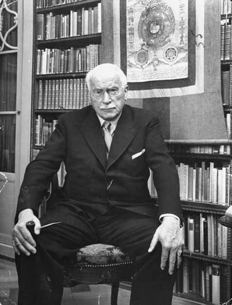
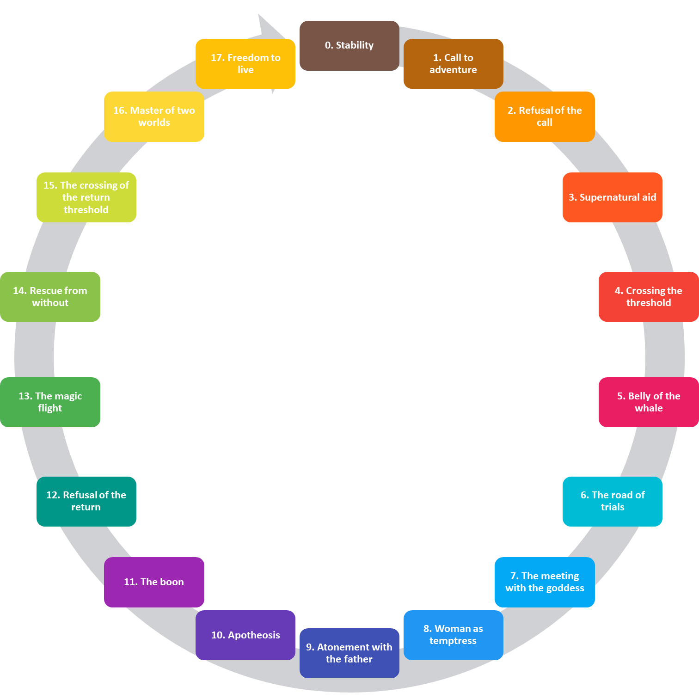
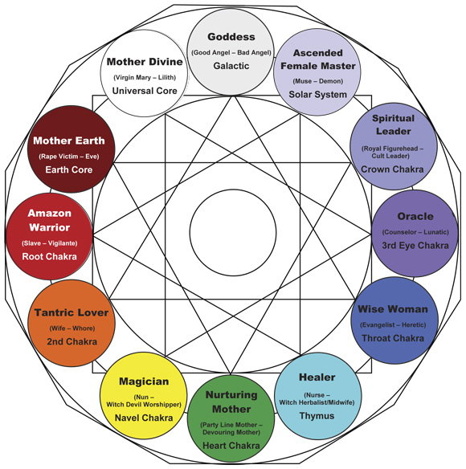

# History of Archetypes

***Warning:* This is a work in progress, i.e., currently just a collection of unstructured information.**

Archetypes, in their "psychological" meaning (as related to the structure of the mind), were originally conceptualised, defined as such, and popularized by Carl Jung in the early 20th century. Thus, a meaningful history of archetypes should start here, with Jung, although deeper and earlier roots and sources of inspiration are often mentioned (for instance, by Jung himself). Regarding these often-cited "ancient roots" of archetypes-related ideas, it is important to note, however, that they usually take the form of posterior re-interpretations done through a Jungian lens (eventually leading to deformations and misinterpretation of the original ideas). Thus, understanding the Jungian approach is a relevant starting point to understand the history and current state of archetypism, its brilliance as well as its limitations. As we will try presenting the different views and claims neutrally, the reader should keep in mind that many of the assertions have not been scientifically validated.


## Carl Jung (1875 - 1961)


### Historical context

The end of romantic era, in the late 19th century, was marked by the after-effects of the industrial revolutions and their major discoveries (e.g., electricity), that stirred up a bubbling environment for arts, philosophy and science. It is for instance when neuroscience makes its formal *debuts* [even though the term "neuroscience" would appear only a century later, in the 1960s; @rose20155o], and when psychology starts its process of independence as a scientific field, coexisting (and co-thriving) with pseudo-scientific approaches such as hypnotism or the theory of Orgone. <!-- add more examples -->

```{block, type='FOO'}
Some text for this block.
```

> "It was a time when poets consorted with laboratory scientists, 
when philosophical doctors developed scientific theories, 
when Alexander Bell could work out his physiological psychology in a series of lectures to London artists, 
when scientists could perform as showmen, 
and researcher’s experiments could be replicated by an eager public wherever it was possible.” [@richardson2001british]

Our story starts right after, at the dawn of the 20th century. These are turbulent times for psychology, being torn between two opposite movements, one aiming at the pure reduction of mind to a set of laws and rules constrained by biology and physics (behaviourism, psychophysics, Gestalt...), and the other aiming at the reduction of the mind to a set of "extra-biological" entities forming the *psyche* (psychodynamic approaches, ...). 

It is also a time of political unrest, when identities of nations and people are being challenged in the face of emerging doctrines and globalizing economies. Nationalist views are on the rise in Europe, and supposed lost roots are sought in so-called "primitive" cultures, often fuelled by more-or-less (and sometimes fully esoteric) scientific anthropologic theories (one posterior exemplification being the 1938 nazi expeditions to the Himalayas aimed, among others, to investigate possible origins of the Aryan race).

### Jung's Definition

It is in this troubled context that the Swiss psychiatrist Carl Jung gave to "archetypes" its modern meaning in 1919. This concept will be come one of the most important of psychoanalysis [@roesler2012archetypes], marking the split with the Freudian approach and what will become Jung's independent stream of so-called "depth psychology". Originally named "primordial images" (a term he borrowed from the historian of art Jacob Burckhardt), Jung understood archetypes as universal and archaic patterns, or images, that derive from the collective unconscious, itself seen as the psychic counterpart of bodily instincts [@feist2009theories]. 


The Jungian conceptualisation is often presented as a sphere [@cann1986jungian]. Below the surface of consciousness lies the *personal* unconscious (consisting of forgotten information, subliminal perceptions, and other elements that are incompatible with one's conscious attitude). At the core of this sphere lies the *collective* unconscious, shared by all humans, made of instincts and archetypes. They would form the innate tendency to experience the world in a certain way.


Jung makes a distinction between *archetypes-as-such* and *archetypal images*, the former being the underlying forms from which emerge the latter (e.g., the mother, the child, ...). These archetypal images are made *manifest* (i.e., explicit and consciously accessible) as they are filled with specific content through history, culture or personal history [@papadopoulos2012].

```{r, echo = FALSE, fig.cap="Carl Jung (1875 - 1961)."}

```

In his later life, inspired by oriental philosophies, Jung used the term *unus mundus* to describe the unitary reality which underlay all manifest phenomena. Through it, he expanded the notion of archetypes to the physical world itself, defining "psychoid" archetypes (the non-psychic aspect of the archetype) as fundamental principles of matter and energy, and mediators of the *unus mundus*.


<!-- universal nature -->

Critically, Jung's archetypes stem out of the *collective unconscious*, therefore forming a psychological layer common to all humanity. The collective unconscious is, in Jung's perspective, referred to as the knowledge and experiences that we share as a species, a reminiscent echo of information passed down through generations from before the dawn of mankind.

 
```{r, echo = FALSE, fig.cap="Illustration created by Jung (The Red Book: Liber Novus, 2009)."}
knitr::include_graphics("img/jung_red_book_serpent.jpg")
```


### Supposed Manifestations of Archetypes

<!-- Dreams -->

A large part of Jungian's model is rooted in the analysis of dreams. The (still lasting) popularity of his approach could be related to its imcreased straightforwardness, as compared to Freudian's more convoluted interpretation framework. Contrary to the latter, Jung believed that the meaning of a dream was directly present in the manifest content of the dream (i.e., what the dreamer experiences). 


Jung distinguished two types of dreams: the archetypal and the everyday [@cann1986jungian]. Everyday dreams find their origin in the personal unconscious and are related to personal matters. Archetypal dreams, on the opposite, originate from the collective unconscious, and deal with universal themes. The best criterion for distinguishing archetypal dreams appears to be their lack of "everydayness" [@kluger1975archetypal; @cann1986jungian].


<!-- Myths -->


<!-- Stories -->

<!-- Personality -->

Jung classified personality types by using three pairs of opposites: *introversion* (directing interest and attention towards internal experiences and processes. ) - *extraversion* (directing interest and attention towards people and things in the external world), *sensation* (perceiving the presence and qualities of facts directly through the senses) - *intuition* (perceiving the relations in events and situations unconsciously), and *thinking* (organizing and judging experience on the basis of analysis and logic) - *feeling* (organizing and judging experience on the basis of importance, values, likes, and dislikes). 

This model of personality is somewhat not too distant from modern accounts (such as the Big Five and its successors), especially regarding the introversion-extraversion axis. However, a distinction is to be made, as Jung's model does not incorporate one of the other personality dimension, namely *neurosis* (i.e., emotional instability), as such. Instead, Jung conceptualises neurosis as the opposite of psychosis, both related to the pattern relationship between the conscious and the unconscious. In summary, people with neurosis would be out of contact with the collective unconscious, whereas people with psychosis are too much in contact with it, at the expense of external reality (hence the strong interest of Jung for patients suffering from schizophrenia). Additionally, contrary to more recent models in which personality dimensions are conceptualised as to a large extent indepedendent (i.e., all combinations of personality traits are possible), the expression of Jungian's neurosis depends on other dimensions. For instance, the typical form of neurosis for people with high introverion is anxiety, and hysteria (characterized by high activity levels, physical complaints, and emotional volatility) for extroverts.

Importantly for our topic, archetypes have not been directly connected with any personality profiles. Instead, Jung and his followers attempted to use their own conceptualisation of personality profiles (i.e., and of their configuration regarding the relationship between the conscious and the unconscious) to gather evidence in favour of their theory. For instance, by showing that people with high intuitiveness and low neuroticism recall more archetypal dreams [i.e., dreams with less "everydayness"; @kluger1975archetypal; @cann1986jungian].


### Archetypes as Parts of the Psyche

Jung also named "archetypes" what could be seen as parts of the psyche. In particular, he focused on five of such dimensions: 


- The **Anima** and the **Animus** are the feminine and masculine aspects of our Psyche. He mentions four distinct levels of development for the feminine Anima, corresponding to its formation and evolution during the lifetime of an individual. *Eve* is the first stage, where the anima emerges in the shape of the male's object of desire. She then becomes *Helen* (of Troy, who sailed away from his husband), an independent and intelligent woman. She achieves virtue in *Mary* (the purest figure in Christian tradition), and finally becomes *Sophia*, the incarnation of the idea of divine wisdom. For the Animus, the main features of the four parallel stages of development include physical power (such as "the fictional jungle hero *Tarzan*"), action and romance (the *hero*), knowledge (professor or the clergyman), and spiritual wisdom (*Hermes*, the messenger of the gods). Like Sophia, it is considered the highest level of mediation between the unconscious and conscious mind. It is interesting to note the subtle mirroring of the feminine and masculine stages. While the first stages are both characterized by bodily needs and drives (sexual beauty and physical strength) and then action and commitment, the third stage underlines values of morality for the feminine and knowledge for the masculine, that could be seen as immaterial and material forms of wisdom. Finally, the last stage emphasizes a more spiritual and esoteric aspects of wisdom (Sophia and Hermes being two central figures in alchemy and others esoteric doctrines).

<!-- Faire GRAPHIQUE avec tout les stages et leurs main features on parralel -->


- The **shadow** is the part of one's Self to which the conscious ego does not identify.
- The **Persona** refers to the image that a person presents to the world. According to Jung, the Persona is "a kind of mask, designed on the one hand to make a definite impression upon others, and on the other to conceal the true nature of the individual". It emerges from the amalgamation of what an individual wants to be, what he thinks he is, what other people think of him and what they want him to be.
- The **Self** is the realised product of the integration of all conscious and unconscious aspects of our personality.


<!-- list -->
Interestingly, while the archetypal images (the manifest motives) are usually the main focus and interest of subsequent authors (see below), it is important to note that Jung himself warned against such simplification. Such *"definite mythological images of motifs [...] are nothing more than conscious representations; it would be absurd to assume that such variable representations could be inherited"*. Again, the true archetypes for Jung were their deeper, instinctual, fluid sources – *"the 'archaic remnants', which I call 'archetypes' or 'primordial images'"* [@jung1964approaching].


<!-- Describe the excellent work by @lequellec2013jung. -->


## Philosophical roots

It is common to mention Plato's Idea as the origin or philosophical basis for archetypes, mainly because of Carl Jung's supposed inspiration. 

Pre-Jungian Usages of the Word:

- Plato's idea theory
- segue into Christian philosophy
- Descartes (?)


## Archetypal Interpretation of the Tarot

Before we dive in into more classical neojungian archetypes, let us take a *detour* by an object which obscure symbolism has *de facto* endowed it with esoteric knowledge which access was attempted using archetype-like concepts.

The first documented tarot packs were recorded between 1440 and 1450, and are likely to have entered Europe from Egypt in the late 14th century. The Tarot consists of 78 cards - 56 in the *Minor Arcana* and 22 in the *Major Arcana* (also known as the trump cards), which consists of the emblematic picture cards of a tarot deck. Although the tarot being a very old game, its interpretation as having a relationship with archetypes was started by Jung himself in [1933](https://marykgreer.com/2008/03/31/carl-jung-and-tarot/). "They are psychological images, symbols with which one plays, as the unconscious seems to play with its contents." The content on these cards, said Jung, "are sort of archetypal ideas, of a differentiated nature."

```{r, echo = FALSE, fig.cap="The 22 cards in the Major Arcana of the 'Tarot de Marseilles'."}
knitr::include_graphics("img/tarot.jpg")
```

The *Major Arcana* consists of 22 cards, numbered in Roman numerals from I to XXI, while The Fool is the only unnumbered card, sometimes placed at the beginning of the deck as 0, or at the end as XXII. They represent, respectively, *The Magician* (I), *The High Priestess* II(), *The Empress* (III), *The Emperor* (IIII), *The Hierophant* (V), *The Lovers* (VI), *The Chariot* (VII), *Strength* (VIII), *The Hermit* (VIIII), *Wheel of Fortune* (X), *Justice* (XI), *The Hanged Man* (XII), *Death* (XIII), *Temperance* (XIIII), *The Devil* (XV), *The Tower* (XVI), *The Star* (XVII), *The Moon* (XVIII), *The Sun* (XVIIII), *Judgement* (XX), *The World* (XXI) and *The Fool* (XXII).

It is understandable that the mysterious origin of the Tarot, its esoteric figures, and critically the symbolic details present in them created a fertile terrain for all kinds of interpretations. Attempts to map these figures to Jungian concepts have been numerous. For instance, the Fool, interpreted as carefree ignorance, has been connected with the unrealised Self. He carries a closed bag, said to contain the tools that could allow him to achieve wholeness. On the other side, the World card (XXI), representing completion and success, has been related to the Self realised, as it shows an individual floating amongst the clouds. His nudity can be interpreted as transparency and revelation, where what was hidden before has now become known. The four animals present in the corners corresponds to the four elements in Christian symbolism, and are interpreted as evidence that the individual has harnessed the four elements present within Nature (being the fifth element).


## Joseph Campbell (1904 - 1987)

In "The Hero with a Thousand Faces", @campbell1949hero, inspired by Jung, presents his theory of the mythological structure of the journey of the archetypal hero extracted by comparing myths from different regions of the world. Coined the "Hero's Journey", he describes the ultimate narrative archetype as a "monomyth" (a recurring mythological motif). 

Importantly to our topic of archetypes, he identifies common tropes or characters that take part in this meta-narrative. For instance, the young hero, the wise old man or woman, the goddess, the temptress and the shadowy antagonist, that he relates to archetypes. He suggests that such myths and stories have a narrative structure that mirrors or echoes the psychological structure of the mind, which is the reason of their power.

```{r, echo = FALSE, fig.cap="Campbell's (1949) 17 stages of the hero's journey."}

```

## Robert Moore (1942 - 2016)

In "King Warrior Magician Lover", @moore1991king discuss the four primary masculine archetypes:

- King
- Warrior
- Magician
- Lover
  
To each one of these archetypes correspond an immature version: 

- The Divine Child
- The Hero
- The Precocious Child
- The Oedipal Child

  
In the same framework, feminine (although not directly mentioned by the original authors) are:

- Queen 
- Mother
- Wise woman
- Lover

## Carol Pearson (1944 - Present)

In "The Hero and the Outlaw", @mark2001hero discuss twelve archetypes:
 
- The Innocent
- The Orphan / Everyman
- The Hero
- The Caregiver
- The Explorer
- The Rebel
- The Lover
- The Creator
- The Jester
- The Sage
- The Magician
- The Ruler


```{r, echo = FALSE, fig.cap="The 12 archetypes and the specific 'universal needs' that they address, grouped by their orientation (ego, order, freedom and social) and type (based on their 'driving source'): the diagonal archetypes (outline in black) correspond to the Self type, the vertical archetypes (outlined in white) to the Ego type, and the horizontal archetypes (outlined in grey) to the Soul type."}
knitr::include_graphics("img/12archetypes.png")
```

This framework has been complexified, grouping these twelve archetypes into sets, for instance by classifying them into three types relative to their "driving source". For instance, the *Ego* type (Innocent, Orphan, Hero and Caregiver) is driven to fulfil ego-defined agendas and *mutatis mutandis* for the *Soul* (Explorer, Rebel, Lover and Creator) and *Self* (Jester, Sage, Magician and Ruler) types. 

Additionally to the type, these archetypes can also be clustered according to their orientation on a two-dimensional plane with four cardinal points, which are *Ego* (leaving a mark on the world), *Order* (providing structure), *Freedom* (yearning for paradise) and *Social* (connecting to others), creating pairs of opposite (Social and Freedom being opposed to Ego Order, respectively).

The type and the orientation are additive groupings. For example, the Caregiver, being of the Ego-type, is driven by the need to fulfil ego agendas, through meeting the needs of others (characterising its social orientation). In a different way, the Hero, also driven by the same need to fulfil ego agendas, does so through courageous action that proves self-worth (characterising its ego orientation).

Finally, each of these twelve archetypes is addressing a specific "universal Human need", namely *safety* (the Innocent), *belonging* (the Orphan), *mastery* (the Hero), *service* (the Caregiver), *freedom* (the Explorer), *liberation* (the Rebel), *intimacy* (the Lover), *innovation* (the Creator), *pleasure* (the Jester), *understanding* (the Sage), *power* (the Magician) and *control* (the Ruler).


However, it is important to note that the framework proposed by @mark2001hero was initially created with companies in mind rather than individuals *per se*, to help new business developing their brand by increasing their identification with specific archetypes. This archetypal branding could facilitate, supposedly, directly communicating with the potential client's unconscious in order to sell more products. This is followed by attempts to attribute dominant archetypes to existing brands. This perspective and usage of archetypes is, in our humble opinion, quite nonsensical in regards with science.


```{r, echo = FALSE, out.width = "49%", fig.show='hold', fig.cap="Examples of association between existing brands and archetypes (retrieved from https://visionone.co.uk/app/uploads/brand-archetype-wheel.png and https://www.retailmarketing.com/wp-content/uploads/2017/09/Pic2.png)."}
knitr::include_graphics(c("img/brand_archetypes1.png", "img/brand_archetypes2.png"))
```


## Other Developpments

The coach Scott Jeffrey, after disguising random information as facts (e.g., *"archetypes influence 99% of human behavior"*), ends up with a list of [over 325](https://scottjeffrey.com/archetypes-list/) archetypes (!), suggesting that their number is even larger (*"the reality is that there are thousands of archetypes. Each one possesses different behavioral patterns and subtleties"*). Besides the uselessness of an infinitely fined-grained concept, these classifications (that the author defines himself as *"set patterns of behavior"*) are clearly different from archetypes as conceptualised in this book.


```{r, echo = FALSE, fig.cap="The 12 female archetypes described by Lucie René, supposedly 'handed down from the Matrilineal Era' but later 'fractured, polarized, and corrupted during the Patriarchy' (retrieved from https://luciarene.com/pdfs/Archetype-Diagram.pdf)."}

```
