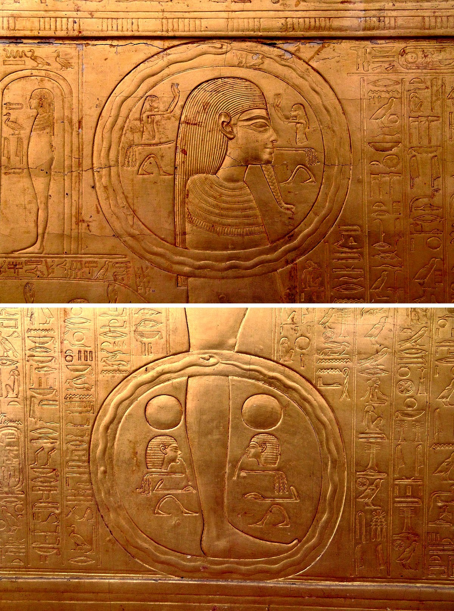

# A Scientific Archetypism

***Warning:* This is a work in progress, i.e., currently just a collection of unstructured information.**


## From Theory to Application

Following Jung's work, many archetype theorists have adopted a "bottom-up approach", i.e., starting from observations to infer the cause (the nature of archetypes). Observations are gathered by exploring various cultures, myths, religions or the depths of Human's psyche (using tools of pseudo-access such as psychoanalysis or hypnosis). In this framework, the archetypist's role is to assemble and integrate the interpretations emerging from these observations, in a theory that could be applied to explain these observations.

In this book, we will take the opposite approach. Based on scientific knowledge about evolution, biology and neuroscience, we will outline a plausible framework, that we will then test on observations and facts.

## A Falsifiable Theory


The fundamental issue of psychoanalysis is that it is not a scientific theory, which requires a possibility of falsification. For example, Newton's law of gravity could easily be falsified if, for instance, the apple did not fall from the tree but levitated there (and it has been later falsified by astronomical observations, and eventually replaced, by Einstein's set of theories). On the contrary, every observation is evidence in favour of psychoanalysis, and the same can unfortunately be said for Jungian's approach.

This pseudoscientific nature is particularly relevant for the Jungian conceptualisation of archetypes, which suffers from a structural and inherent unscientificalness. In metaphorical terms, we could say that it is an *ouroboros* (the symbol of a dragon/serpent eating its own tail): the natural "consequences" of archetypes (i.e., the manifest patterns and motifs that we observe in myths, stories, religions...) are also, in theory, the "cause" of them. In other words, the existence of numerous instances of wise old men is brandished as the one of the only possible manifest proof for the existence of the archetype of the wise old man. And the redundancy of this motif is also what perpetuates its archetypal nature. The serpent eats itself, and the existence of this archetype, as it is tied only to a given existing observation, is unfalsifiable. On an abstract level, if *B* is the cause of *C*, scientists would investigate the cause(s) and origin(s) of *B*, let it be *A*, so that *A* &#8594; *B* &#8594; *C*. The system has a clear causal structure. For archetypes, the current approach suggests that *A* &harr *B*: archetypal images are made *manifest* (observable, and thus measurable) as they are filled with a idiosyncratic content (depending on the culture, beliefs, personal experience etc.). Hence, we cannot demonstrate that archetypes do not exist, because every motif is potentially a proof in favour of an archetype.

```{r, echo = FALSE, out.width = "49%", fig.show='hold', fig.cap="The oldest evident depictions of an ouroboros to date, appearing on the second gilded shrine of Tutankhamun (14th century BC)."}

```


Therefore, how to scientifically test (and refute) archetypism is the core question of any scientific approach to archetypism. Thus, after outlining our perspective on archetypes in the following chapters, we will propose practical ways to assess their existence and role in societyand individuals.


## Limitations

One practical limitation of our approach is that some of the data is already known, which makes it hard to blindly derive predictions from our model that one could later test. For instance, if we postulate that archetypical motives could be present within the similarities of myths, stories and religions, it is hard not to be inspired and influenced by the existing facts. Even with good theorethical reasons, it appears as complicated to postulate the existence of a given archetypal motive if we know in advance that its presence in Human productions is very seldom. Our cultural environment influences its theorization. Altough it is also the case in other scientific fields, it might be stronger when it comes to archeypes, as they are particularly deeply connected with cultural manifestations.


Another, more fundamental, angle of attack concerns the practical value of generic archetypes. As we have seen in previous examples, some authors proposed a list of archetypes so vast that their usefulness and relevance as a scientific concept is limited. On the other hand, others authors (including Jung) emphasize quite generic figures, such as "the father" or "the mother". The issue with this is that the fact that that these figures and concepts are critically important in Human culture cannot be used as a evidence in favour of their archetypicity. Yes, a loving mother and a fearless father are common tropes in Human existence. One could thus wonder about the relevance of creating a whole theory around them. Thus, finding the right level, between specificity and genericity, appears as an important challenge for our endeveour.

<!-- The goal of the archetypist is to study these and uncover their role in society or individuals. -->

<!-- Examples of experiments: -->

<!-- - Child remembers a story and its content where the protagnositc are congruent with archetypes? -->
<!-- - Pseudo-role playing game where participanats have to decide which archetypal character to go ask for specific archetypical questions  -->
<!-- - Comparative exploration of proto-religions -->


