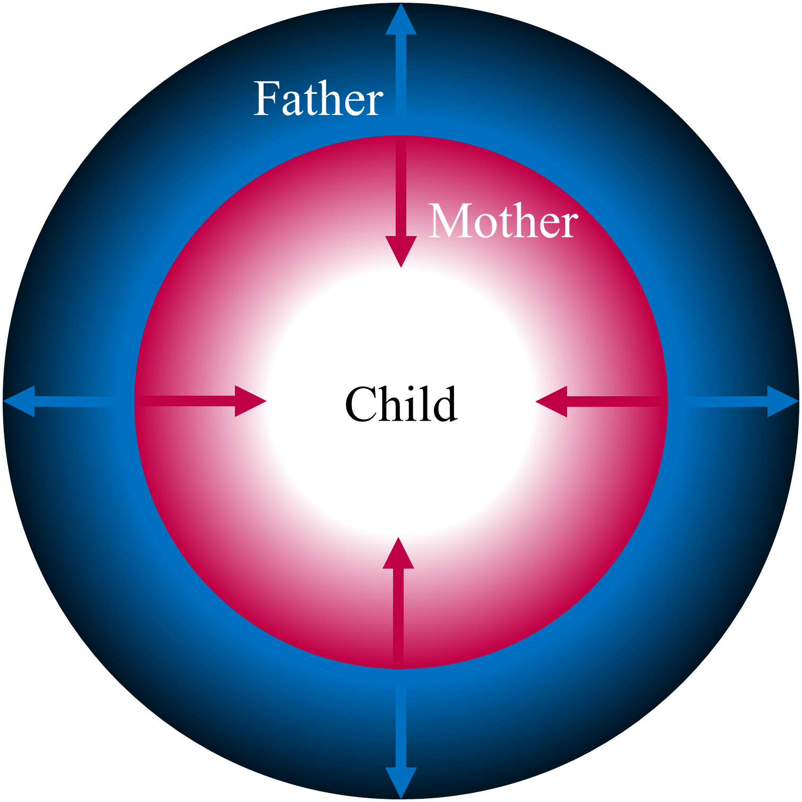
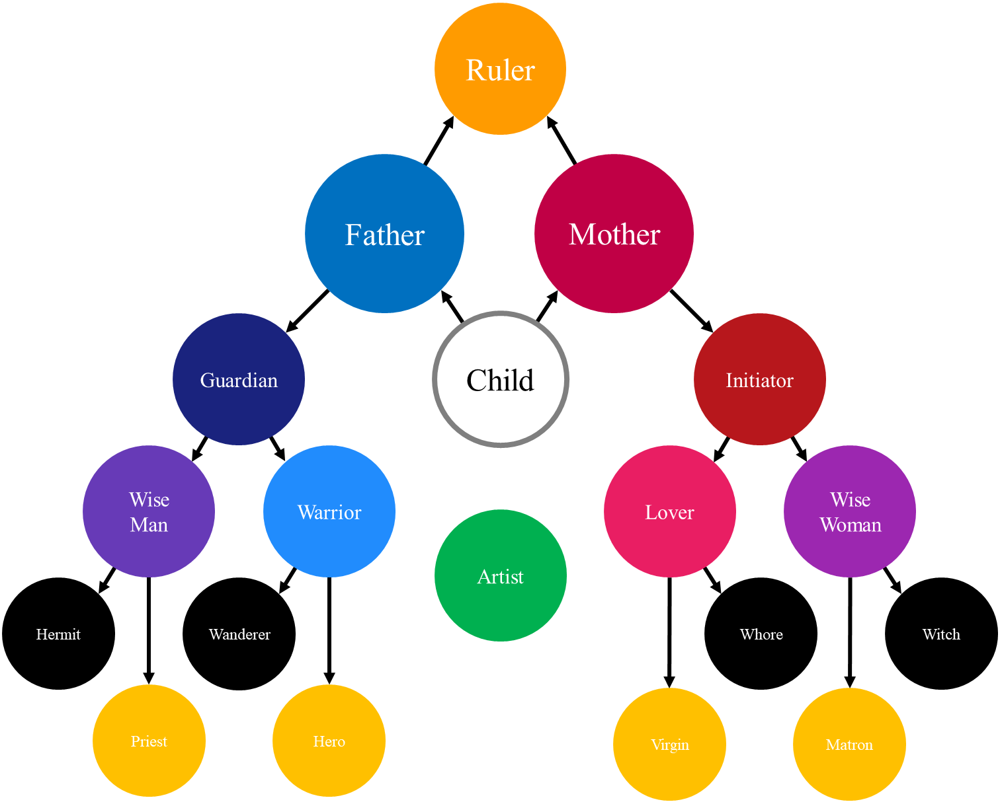

# The Main Archetypes

***Warning:* This is a work in progress, i.e., currently just a collection of unstructured information.**

The main archetypes discussed in this chapter reffered to as "axial archetypes", as they emerge from to the axes that structure our mental system. As this system grows and complexifies, its dimensionality increases, creating new planes and providing more coordinates to navigate in this space. As a result of the densification of this matrix, archetypes become more subtler, fine-grained and ultimately fading into the unicity that is characterising our identity.

Thus, archetypes are usually paired (as they are the two spaces created separated by a line), creating a symmetric and hierarchical structure. Importantly, they can be identified, and grouped, relative to their causing axis, which is often an important distinction that the organism has to learn in order to adapt.

Thus, evidence for archetypes can be indirectly gathered by demonstrating the existence and relevance of their axis of reference. 

## Masculine and Feminine

Existing theories and models often associate archetpyes with specific genders, namely "feminine" and "masculine". While this will also be the case in the current book, the reader must be aware that we see it mainly as a flexible (and convenient) appelation. In the archetypal framework, the Masculine and Feminine adjectives do not directly refer, nor are limited, to their respective biological genders, but rather to features of the two primordial archetypes, the father and the mother (see below). That does not preclude that a masculine archetype can be embodied by a female figure and *vice versa*.

Moreover, another limitation of this pseudo-sexualised perspective is that it is, to some extent, anthropomorphic or primatomorphic (or at least mammalomorphic). Indeed, in these classes and families, males often endorse the role of protection, fighting for females through which reproduction can be achieved. However, other taxa of animals, with different reproduction systems, might have these roles changed, or reversed. For instance, in ants, the ruler and the warriors are Females, whereas the males are typically exhibiting roles that would be anthropomorphically labeled as feminine. Thus, while we will keep using Masculine and Feminine in their primatal sense, these adjectives may not be universally relevant.


## The Two Worlds

The Outside *vs.* the Inside, or the external and internal worlds (or Self vs. non-Self), is the first axis differenciating our proto-experience.

Transcendal vs. Natural.

The newborn is a fragile and dependent entity, which safety depends on the *Mother* and the *Father*. These are the first 

Both are vectors of **protection**. The father protects from the outside world, unknown and dangerous, while the mother protects from internal dangers by fullfilling biological needs (hunger, thirst, affection, ...). Common mistake is to consider that only father is protection. mother is a protective figure too, and can be one of the fiercest [(e.G., Jessen, 2019)](https://doi.org/10.1101/827626).

These two primordial archetypes will create the primordial axis, external vs. internal worlds.

A secondary axis could be the real vs. the unreal.

<!-- need and goal, the mother needs protection and achieves creation (by being turned toward the internal) , the father achieves protection and goes toward the external unknown. image of the two serpents, one facing the outside as a ring of protection, the other facing the inside -->

<!-- wo fundamental archetypes: Father and Mother. Protection and Creation. Two derivatives, the Guide (the sage, male basis with the role of guiding and teaching knowledge) and the Guidess (the witch, the temptress, guiding and teaching material knowledge).  -->

<!-- mother est aussi le matériel, le temporel, c'est la nature. hence mother nature as one of the earliest divinity. father est le divin, l'éternel, le transcendant. hence dieux qui a souvent une figure masculine.  -->

```{r, echo = FALSE, fig.cap="The Primordial Axis."}

```


## Known *vs.* Unknown

Knowledge

Knower of beyond vs. knower of within.

The child wants to know, and understand this world around and within him. From the Mother, master of nature, stems out the *Feminine Knower*. From the Father, master of the transcendent, stems out the *Masculine Knower*.


## Time


## Moral

For elderly figures, this is assimilated with the place in the society, whether inside (priest, matron) or outside (hermit and witch). For young figures, this reflects the societal and cultural judgment. The hero and the virgin are pure archetypes of virtue, whereas the wanderer and the whore are usually societal and cultural outcasts.


## Order

At one point, the realisation comes that all these figures are subordinated to an overarching ordering and structuring force, the *Ruler*. Altough this archetype has often been related or embodied by Masculine entities, it does not need to be so, as it highly depends on societal and biologoical factors (related to the culture or Specie concerned). For instance, due to the cultural and political system of the western world (for instance, feodalism), the ruler position was generally connected to some level of physical protection offered (hence the king was usually glorified as a great warrior).

society vs outside = order vs chaos 

## Death

Death is surely a major drive. Death (Order) vs. Life (Chaos) duality?

## The artist

The artist is the integration of the feminine creation with the masculine transcendental nature of the object. Located at the centre, it shares aspects and potentialities of other archetypes. For instance, the artist can take uptake the purity, such as Michel-Angelo, or being the outcast, combining features of the hermit, living on the fringes of society, but also with the wanderer (as the rogue traveller and story-teller), as well as the whore () or the witch ().


```{r, echo = FALSE, fig.cap="The main archetypes and their hierarchical structure."}

```

## The Serpent

The serpent represent the cyclical nature of existence. A mother creates a child, the child becomes the mother, and the cycle restarts.

Becoming an adult means facing the serpent. Alternative ways can be to embrace (become the serpent (fulfilling the archetypes and becoming the Father or the Mother), or to battle the serpent, by trying to break the cycle.

The serpent represents also the Self, always changing, but always the same. Battling the Serpent means casting light onto the external and internal shadows.


## Light and Shadow

The stronger the light, the darker the shadow.
Idea that everybody has a "shadow", a collection of morally reprehensible desires and thoughts, and that its strength is proportional to the amount of light shining from the persona. Yin and Yang. True peace of mind could be achieved by reuning them (The Grey Path).


<!-- the horned god, i.e., the animalistic part -> the animal/natural part -> the uncontrolled part-> the threat to societies -> the bad -> satan -->


<!-- The primordial trinity: the goddess-mother (derived from the mother archetype), the male-bull (derived from the father archetype) and the serpent, lying among the farther away from an evolutionary and taxonomic standpoint, therefore represneting the bizarre, the dangerous, the nature and the unknown. At the same time, there is a snake in us, because the snake can also represent the Self (always changing but always the same). As such, the battle against the snake is both external and internal.  -->

<!-- The god snake is an ambivalent entity, sometimes creator / positive (Quetzocoatl) and sometimes negative (jormungandr, tiamat). In fact, representing the cycle (snakes sheds its skin and can be represented as a circle), the snake is inherently ambivalence, representing the fact that creation and destruction are the sides of the same coin. Similarities with Hindu Shiva, creator and destructor. It is thus unsuprising to note that one of the iconographical attributes of Shiva is the serpent around his neck.-->

<!-- It is not that the warrior archetype has an ontological existence, that it exists as-is by itself. It's rathet than the stereotypical image of the warrior embodies and is a realization of the feature of the figure occupying that mental space. The image of the warrior is slowly shaped by myths and legends, which in turn affect the identification of people with this archetype. -->
