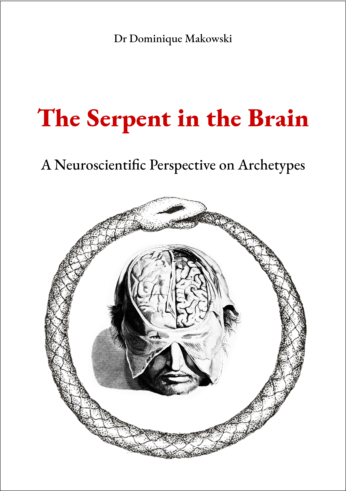

# The Serpent in the Brain: A Neuroscientific Perspective on Archetypes

<a href="https://dominiquemakowski.github.io/archetypes/">
  
</a>


--- 


- Read online [**here**](https://dominiquemakowski.github.io/archetypes/)
- Download the pdf [**here**](https://github.com/DominiqueMakowski/archetypes/raw/master/pdf/archetypes_makowski.pdf)

---

<!-- ```{r include=FALSE} -->
<!-- knitr::opts_knit$set(root.dir = './content/') -->
<!-- # setwd("./content/") -->
<!-- ``` -->


```{r child = 'content/00-preface.Rmd'}
```


<!-- ```{r include=FALSE} -->
<!-- knitr::opts_knit$set(root.dir = '../') -->
<!-- # setwd("../") -->
<!-- ``` -->
