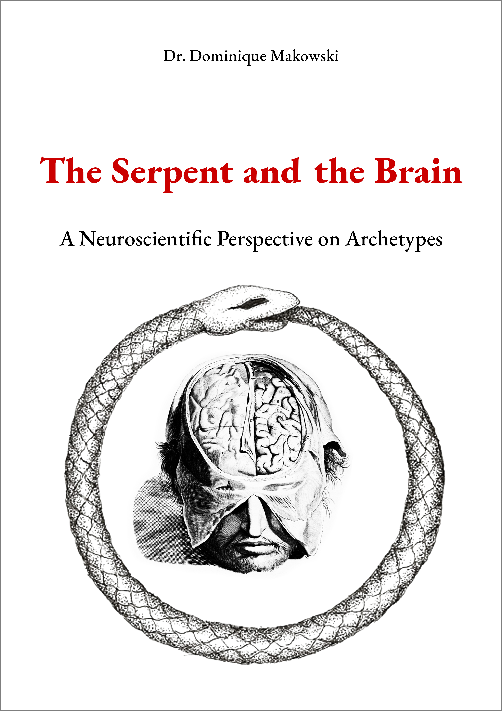

# The Serpent in the Brain: A Neuroscientific Perspective on Archetypes

***Disclaimer:* This is a compilation of thoughts that might be someday used in a fictional novel. It does *not* reflect any personal beliefs.**

***Warning:* This is a work in progress, being currently just a collection of unstructured information.**

--- 

- Read online [**here**](https://dominiquemakowski.github.io/archetypes/)
- Download the pdf [**here**](https://github.com/DominiqueMakowski/archetypes/raw/master/pdf/archetypes_makowski.pdf)

---

The idea that the mind is deeply organized along universal lines has always been fascinating to me. Although strongly criticized and mostly debunked by science, the notion that cognition is structurally clustered in a similar way across time and space has endured, gradually leaving the prison of scientific psychology to pervade other fields, such as history of arts, literature and anthropology. In fact, the notion of archetypes has become quite popular in the recent years, evidence being "found" within the redundancies of Human behaviours, myths and stories of old. In turn, understanding and acknowledging the existence of archetypes is often presented as a step toward personal development, if not mental health.

**But beyond the scent of pseudo-science that emanates from this concept, do archetypes make any scientific sense?** 

Archetypes, as they are commonly defined and conceptualized (i.e., with a Jungian-based psychodynamic approach), are hardly compatible with the current scientific knowledge. For instance, Jung's collective unconscious has no place in light of what we know about neurogenesis, neurodevelopment, and functional or structural neuroanatomy. Similarly, research on personality and psychological inter-individual differences does not support the existence of profiles that would resemble commonly described archetypal figures (for example the warrior, the hero or the old man). Nonetheless, I think (and hope), that a scientific approach to archetypism (the study of psychological archetypes) is possible and potentially interesting. Thus, the goal of this book is to provide a new and rational perspective on archetypes, informed by biology, psychology, and neuroscience. 

