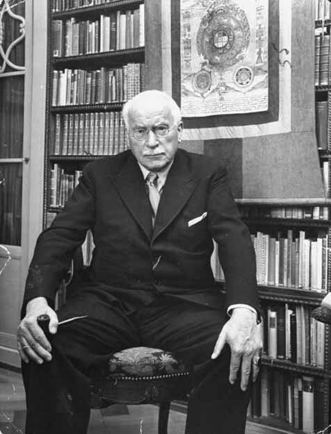

# History of Archetypes

> _All the most powerful ideas in history go back to archetypes._
>
> `r tufte::quote_footer('--- C. G. Jung (1960)')`

The idea of ancient and primitive entities and forces guiding men and civilizations is by any means new, and was certainly not unpopular in the early 20th century. Nonetheless, C. G. Jung (1875 - 1961) was the first to define, describe and popularize a psychological concept that will be the basis for archetypes as they are commonly understood today. 
Jung's theory, through its interesting ideas as well as limitations, is thus a relevant starting point to understand how archetypes evolved from inaccessible entities which can be used to investigate the hidden core of Humanity, to stereotypical images, used predominantly to achieve individual goals (for instance well-being, growth or success).


## C. G. Jung (1875 - 1961) and his Archetypes


The archetypes are a complex and proteiform concept in Jung's work, with multiple, sometimes exclusive and conflicting definitions. They are, at the same time, the product of his investigations (through the analysis of texts, stories, or mental productions of patients), as well as a tool used to give meaning to obscure patterns and objects. Importantly, this concept does not emerge *ex nihilo*. Indeed, older roots, sources of inspiration and usages of the word 'archetypes' can be traced in earlier philosophical or historical works.  

Jung himself, later in his career, attempted at reconstructing the history of the usage of the word 'archetype' [@spineto2008notion]. Notably, he emphasizes Plato's *Idea* as the origin or philosophical basis for his theory of archetypes.

> 'Archetype' is an explanatory paraphrase of the Platonic eidos. For our purposes this term is apposite and helpful, because it tells us that so far as the collective unconscious contents are concerned we are dealing with archaicor - I would say - primordial types, that is, with universal images that have existed since the remotest times (Jung, 1969, pp. 4–5).

Jung also mentions other philosophical sources of inspiration, such as Philo, who linked the archetype to God's image present in man, Irenaeus, for whom the archetypes were the models of creation, the Corpus Hermeticum, in which God is called 'archetypical light', Dionysius the Areopagite, who often used the word, Saint-Augustine, which expressed similar concepts (though without using the term), or Kant, outlining archetypes as the imagination and fantasy counterparts of Kant's logical Categories of reason. 

However, the initial influence might have been less that of such major philosophers and noble academic developments, but could be actually related to an interest in, or an inclination for, the esoteric and the occult, quite popular in the intellectual milieu of Jung's time.


```{r, echo = FALSE, fig.cap="Carl Jung (1875 - 1961)."}

```


### Historical and philosophical context

The end of romantic era, in the late 19th century, was marked by the after-effects of the industrial revolutions and their major discoveries (e.g., electricity), that stirred up a bubbling environment for arts, philosophy and science. It is for instance when neuroscience makes its formal *debuts* [even though the term "neuroscience" would appear only a century later, in the 1960s; @rose20155o], and when psychology starts its process of independence as a scientific field, coexisting (and initially co-thriving) with pseudo-scientific approaches and ideas such as parapsychology, mediumship, hypnotism, vitalism, magnetism, odology or the theory of Orgone. <!-- add more examples -->

> "It was a time when poets consorted with laboratory scientists, 
when philosophical doctors developed scientific theories, 
when Alexander Bell could work out his physiological psychology in a series of lectures to London artists, 
when scientists could perform as showmen, 
and researcher’s experiments could be replicated by an eager public wherever it was possible.” [@richardson2001british]

Our story starts at the dawn of the 20th century. These are turbulent times for psychology, being torn between two opposite movements, one aiming at the pure reduction of mind to a set of laws and rules constrained by biology and physics (behaviourism, psychophysics, Gestalt...), and the other aiming at the reduction of the mind to a set of "para-biological" entities (i.e., which link with biological mechanisms is vague or deemed irrelevant) forming the *psyche* (psychodynamic approaches, ...). 

It is also a time of political unrest, when identities of nations and people are being challenged in the face of emerging doctrines and globalizing economies. Nationalist views are on the rise in Europe, and supposed lost roots are sought in so-called "primitive" cultures, often fuelled by more-or-less scientific (and sometimes fully esoteric) anthropologic theories (such as Blavatsky's Theosophy). This led for instance to the 1938 nazi expeditions to the Himalayas aimed, among others, to investigate possible origins of the Aryan race. 

In summary, although not named nor formally defined as a psychological concept, the idea of archetypes, as well as some form of phylogenetic or racial unconscious was common in the intellectual circles around 1900 [@shamdasani2003cult]. It was a fertile ground waiting to be ploughed.


### The Collective Unconscious

It is in this troubled context that the Swiss psychiatrist Carl Gustav Jung gave to "archetypes" its modern usage in 1919. This concept will be come one of the most important of Jungian's approach [@roesler2012archetypes], marking the split with the Freudian's approach. Indeed, archetypes are inextricably linked to the key concept of Jungian psychology, namely the collective (called first "phylogenetic") unconscious.

Jung is indeed referred as the father of the collective unconscious for his detailed formulation of it [despite the fact that, as mentioned above, the idea was already "in the air" at that time; @shamdasani2003cult]. It is the central concept that sets apart the Jungian approach, i.e., the "analytic psychology" (or, more romantically, "depth psychology"), from the Freudian "psychoanalysis". The concept of collective unconscious ties the study of the mind to the analysis of cultures, societies, religions, myths and stories, and establishes a parallel between the two, enabling to understand one through the study of the other.

The Jungian simplified conceptualisation of the mind is often presented as a sphere [@cann1986jungian]. Below the surface of consciousness lies the *personal* unconscious (consisting of forgotten information, subliminal perceptions, and other elements that are incompatible with one's conscious attitude). At the core of this sphere lies the *collective* unconscious, shared by all humans, filled with instincts, and archetypes. 

<!-- TO IMPROVE -->

### Jung's Definition(s)

What exactly are archetypes? Interestingly, we do not find a consistent specific definition of archetypes formulated by Jung. Originally named "primordial images" (a term he borrowed from the historian of art Jacob Burckhardt), Jung understood archetypes as universal and archaic patterns, or images, that derive from the collective unconscious, itself seen as the psychic counterpart of bodily instincts [@feist2009theories]. These archetypes are supposedly responsible for the innate tendency to experience the world in a certain way. They are "universal patterns producing meaning and guiding development" [@roesler2012archetypes].

Jung makes a distinction between archetypes-as-such and archetypal images (even though Jungians and Jung himself have often failed to maintain this distinction consistently). Archetypes are forms without content, inaccessible and unrepresentable structures from which emerge archetypical images. The archetypes being themselves  contentless, they are often named on the basis of the images whose form they provide. It is common to find specific archetypes named after mythological figures (e.g., the "Hera" archetype), anthropological roles (e.g., the "Mother"), narrative motifs (e.g., "Wise Old Man") or some more abstract themes, such as the archetype of engulfment or the archetype of rebirth. These archetypal images are made *manifest* (i.e., explicit and consciously accessible) as they are filled with specific content through history, culture or personal history [@papadopoulos2012], and can be distinguished from ordinary images based on the subjective impression they make on us: they are salient and emotionally loaded, and appear as deep, mysterious and numinous (i.e., with a spiritual, or awe-inspiring, quality). However, adding to the difficulty is the fact that there appears to be no one-to-one relationship between one archetype and an image. Many images can stem out from the same archetype, and a single image could result from the combination of several archetypes at once.


In 1912, at 36, Jung published his work *Psychology of the Unconscious* (later revised as *Symbols of Transformation* in 1952), which led to a break in the friendship with Freud. In this book, he investigates the autosuggestive writings of Miss Frank Miller, an American writer and stage performer of considerable education. Jung did not know her personally, encountering Miller's "fantasies" through their 1905 publication with a preface by Théodore Flournoy's (a Swiss professor of psychology, interested in parapsychology). In their extensive analysis, Jung starts outlining and describing symbols and patterns, such as "the myth of the hero", the mother, or the sacrifice, that would later become popular archetypal images. Notably, Jung diagnosed Miller's fantasies as "the prodromal stages of schizophrenia" and predicted an evolution into a fully-fledged schizophrenia, which did not happen.  


Jung arrived at the idea of the universality of archetypes after realizing the large number of participants presenting similar "complexes" (i.e., partially repressed, yet highly influential emotional cluster of charged psychic material such as thoughts, feelings, and behaviours, that organises experience, perception, and affect around a central theme). This led Jung to assume the existence of a prototypical pattern behind these similar complexes that would be shared by all human beings. Another stream of evidence came as from Jung's experience with psychotic patients in the Burghölzli hospital in Zurich, where he saw in many of the patients' "fantasies" motifs from ancient mythology. The most famous case being the so-called *Solar Phallus Man*, a patient suffering from paranoid dementia, who reported in 1901 (note that Jung kept changing the dates of this story, as well as hiding the fact that this man was the patient of another psychiatrist) a striking hallucination in which the sun had an upright tail (*"similar to an erect penis,"*, Jung added), which moved back and forth, causing the wind to blow. It is only years later, as Jung became aware of a similar symbol in a recently translated Hellenistic text (The "Mithras Liturgy", part of the *Greek Magical Papyri*), which describes a wind originating from a pipe or tube hanging downright from the disc of the sun. Jung assumed that these two symbols were the same, and since the patient was unlikely to be familiar with this text [or so claimed Jung; see @noll1997jung for a detailed description of Jung's falsifications and lies], its the only possible origin was the collective unconscious.


In his later life, inspired by oriental philosophies, Jung used the term *unus mundus* to describe the unitary reality which underlay all manifest phenomena. Through it, he expanded the notion of archetypes to the physical world itself, defining "psychoid" archetypes (the non-psychic aspect of the archetype) as fundamental principles of matter and energy, and mediators of the *unus mundus*.


All in all, as we can see, Jungian archetypes were not given a single, clear, definition, being instead a rather fluid and evolving concept. However, some authors have attempted at breaking down the Jung's writing on archetypes into several distinct definitions. For instance, @knox2003archetype identifies four different conceptualizations of archetypes, as 1) biological entities, 2) organizing mental frameworks of an abstract nature, 3) core meanings containing representational content and 4) eternal metaphysical entities [@knox2003archetype, p. 24]. @roesler2012archetypes, on the other hand, suggests that archetypes can be defined 1) biologically, akin to instincts in other animals ["an archetype works in a human being in the same way as an instinct which, for example, makes birds build their nest in a certain way"; @jung1949foreword], 2) statistically (the complexes that are redundant and fall into the same category), 3) transcendentally (in relationship with the *unus mundus*, archetypes exist in no real place but in a transcendental plane), and 4) culturally (as the content of the archetypal image is culturally influenced). In summary, "There is no consistent theory of archetypes in Jung and, in my view, it is still missing in analytical psychology as a whole" [@roesler2012archetypes, p. 229].


### Universality

Universality is the central feature of Jungian archetypes.

It is these same archetypal images that appear as motifs in myths, legends, fairy tales, literature, and art all around the world, arising from the same set of archetypes present in the collective unconscious.

Note that the collective unconscious and its archetypes are entirely innacessible to our conscious experience. Jung's collective unconscious is just as unknowable as the Kantian *thing-in-itself*.


Critically, Jung's archetypes stem out of the *collective unconscious*, therefore forming a psychological layer common to all humanity. The collective unconscious is, in Jung's perspective, referred to as the knowledge and experiences that we share as a species, a reminiscent echo of information passed down through generations from before the dawn of mankind.

 
```{r, echo = FALSE, fig.cap="Illustration created by Jung (The Red Book: Liber Novus, 2009)."}
knitr::include_graphics("img/jung_red_book_serpent.jpg")
```


### Archetypes as Parts of the Psyche

Jung also referred to as archetypes in the context of the structure of the psyche. In particular, he focused on five of such components: 


- The **Anima** and the **Animus** are the feminine and masculine aspects of our Psyche. He mentions four distinct levels of development for the feminine Anima, corresponding to its formation and evolution during the lifetime of an individual. *Eve* is the first stage, where the anima emerges in the shape of the male's object of desire. She then becomes *Helen* (of Troy, who sailed away from his husband), an independent and intelligent woman. She achieves virtue in *Mary* (the purest figure in Christian tradition), and finally becomes *Sophia*, the incarnation of the idea of divine wisdom. For the Animus, the main features of the four parallel stages of development include physical power (such as "the fictional jungle hero *Tarzan*"), action and romance (the *hero*), knowledge (professor or the clergyman), and spiritual wisdom (*Hermes*, the messenger of the gods). Like Sophia, it is considered the highest level of mediation between the unconscious and conscious mind. It is interesting to note the subtle mirroring of the feminine and masculine stages. While the first stages are both characterized by bodily needs and drives (sexual beauty and physical strength) and then action and commitment, the third stage underlines values of morality for the feminine and knowledge for the masculine, that could be seen as immaterial and material forms of wisdom. Finally, the last stage emphasizes a more spiritual and esoteric aspects of wisdom (Sophia and Hermes being two central figures in alchemy and others esoteric doctrines).

<!-- Faire GRAPHIQUE avec tout les stages et leurs main features on parralel -->


- The **shadow** is the part of one's Self to which the conscious ego does not identify.
- The **Persona** refers to the image that a person presents to the world. According to Jung, the Persona is "a kind of mask, designed on the one hand to make a definite impression upon others, and on the other to conceal the true nature of the individual". It emerges from the amalgamation of what an individual wants to be, what he thinks he is, what other people think of him and what they want him to be.
- The **Self** is the realised product of the integration of all conscious and unconscious aspects of our personality.


<!-- Transition -->

In the following sections, I will describe the work of some of the representative authors in regards to their contribution to the concept of archetypes. Starting with so-called "neojungian" authors, which contributed to the overall enrichment and acceptance of the notion of archetypes (and were often contemporaries of Jung), the next chapter will focus on "postjungian authors", which gave archetypes their modern definition(s) and usage(s). This listing is by any means exhaustive, but aims at outlining its general evolution and provide the reader with a better understanding of the current state-of-art, and its genesis.


