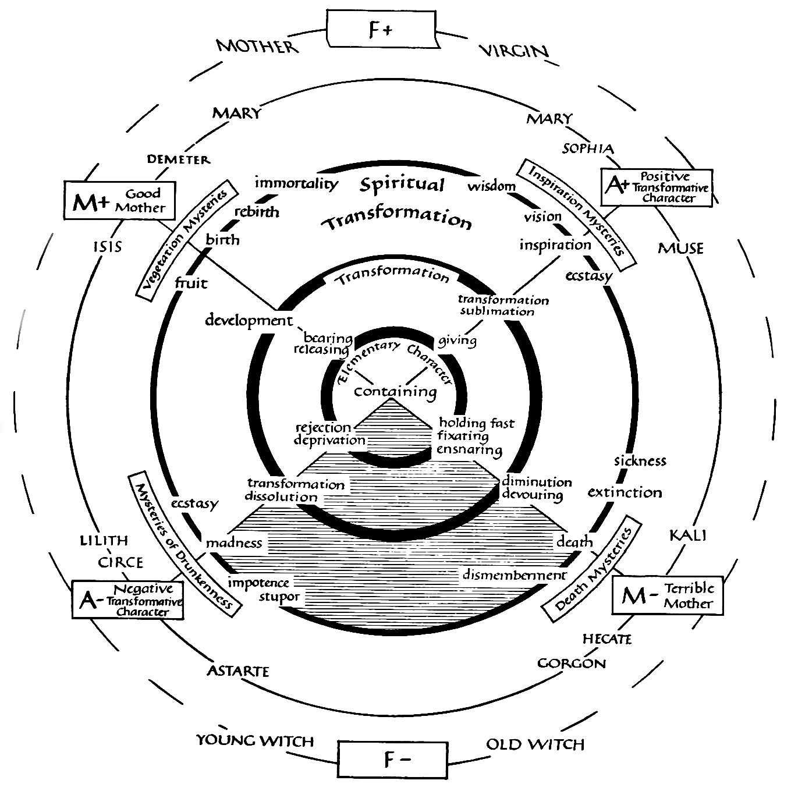

## Neojungian Archetypes

Jung has inspired many authors throughout his life, in particular outside of the field of psychology or medicine. This positive echo in historians, anthropologists, sociologists and theologians surely influenced the orientation of the Jungian approach. This is especially the case for archetypes, which were slowly decoupled from their psychological definition, and became used as a tool to understand (and a product of) ancient societies and systems of beliefs.

### E. Neumann (1905 - 1960) and the Great Mother

```{r, echo = FALSE, fig.cap="Neumann's Great Mother."}

```

Despite being one of Jung's most gifted students, Erich Neumann is a figure whose history is relatively little known. He attended university in Nuremberg, studying philosophy and received his PhD in 1927. Intrigued by psychoanalysis, Neumann began medical studies but was denied an internship because of the race laws affecting Jews introduced by the Nazi government. Having decided in 1933 to emigrate to Palestine, he travelled first to Zürich where he met Jung, thirty years his senior. Neumann decided to stay in Zürich and enter analysis with Jung, while his wife Julia entered analysis with Jung's wife Emma. After nearly a year of analysis, the coupled qualified as analysts (note that in most psychodynamic streams, undergoing an analysis is the sole qualifying criterion to become an analyst). Anecdotally, Neuman's wife earned a high reputation as a professional palm reader.


Neumann published *The Origins and History of Consciousness* in 1949, in which he develops a "psycho-history", arguing that each individual's psychological development recapitulates the history of humanity. Drawing on a range of myths [but hardly ever referring to any dates or datable events; @giegerich1992ontogeny], Neumann suggests that most cultures produce a succession of archetypes intended to enhance individual self-awareness and maturity. He charts what he calls "the mythological stages in the evolution of consciousness", including the creation myth, the hero myth, and the transformation myth (identified with the Egyptian god Osiris). In his view, cultures are also subject to psychological development, evolving from a collective tribal maternal archetype to a paternal archetype, embodied in a prophet. This archetype eventually became repressive and was replaced by a more modern archetype based on individual responsibility. 

<!-- The Earth -->
Interested in how archetypes might be used to encourage modern individual and collective maturation, he then started examining the changing meanings of the *Earth archetype* from the middle ages onwards. Noticing, for example, how his own growing love of the Palestinian desert had matured his Zionist convictions, Neumann concluded that its recent re-emergence as the image of one's bond with the land, was crucial to the religious sentiments of modern man.

<!-- GREAT MOTHER  -->
In his next and most ambitious book, *The Great Mother: An Analysis of the Archetype* (1955), Neumann traces the genealogy and symbolism of goddess figures in world culture. He describes this elemental feminine archetype as a dual figure related to positive aspects, such as release and growth, and inspiration and wisdom, but also to negative aspects, such as retention and devouring, or expulsion and rejection (see diagram). Neumann argued that western monotheist cultures needed to rediscover this archetype to counterbalance the dominant patriarchal consciousness that, if left unchecked, could descend into a brutal masculine ethos, as seen in Nazi Germany.

He proposes to place several important feminine figures along three axes of opposing polarities (positive-negative) composing the Great Mother matrix, namely the Mother, the Anima, and the Transformation. In this framework, Lilith (Adam's first wife) is close to the negative Anima (ecstasy, madness, impotence, stupor), whereas Sophia (the Greek incarnation of divine wisdom) embodies the positive Anima (wisdom, vision, inspiration, ecstasy). Isis (the wife of Osiris and the mother of Horus) is the good Mother (fruit, birth, rebirth, immortality), as opposed to Hecate (the Greek goddess associated with the underworld, magic, and sorcery), the terrible Mother (sickness, dismemberment, death, extinction).

Neumann then tracks the evolution of feminine archetypes from the original *Ouroboros archetype* (the ouroboros being a symbol depicting a serpent-like figure eating its own tail), the "Great Round", representing the primordial unconscious. He suggests that the psychological development of humans, and humankind develops in stages, beginning with the 'matriarchal' stage, symbolized by the Ouroboros, in which the archetype of the Great Mother dominates. In this stage, the ego and the unconscious are fused and form a psychic unity. In the second stage dominates the *Great Father archetype* (associated with rationalism and monotheism), whose invasion is perceived as a destroyer or rapist. In his third stage, the male hero and liberates the young woman from the controlling father. The Great Mother archetype is finally transcended by the male-dominated *Hero archetype*, which victory marks the emergence of the ego consciousness from the unconscious. 

Neumann's work will find a strong echo in art and anthropology, influential for instance for the archaeologist Marija Gimbutas, author of *The Goddesses and Gods of Old Europe* (1974) and *The Civilization of the Goddess* (1991), in which she prefers to use the term "Great Goddess" instead of Great Mother, best describing the absolute rule, as well as the creative, destructive, and regenerative powers of this primordial figure. In her work, she suggests that the Old Europe (pre-indo-european civilization) was composed of woman-centred societies that were peaceful and egalitarian, later supplanted by an indo-european patriarchal and warrior-like culture. This theory is related to Bachofen's (1815 - 1887) theory of matriarchy, postulating the existence of literal prehistoric matriarchal societies, for which no evidence has ever been found. In fact, Neumann himself insists that the matriarchal stage "refers to a structural layer and not to any historical epoch." 

<!-- The Child -->
Neumann's posthumously published work *The Child* (1973), Neumann also uses the *Ouroboros archetype* to describe his view on the initial psychic condition in early childhood. For instance, he discusses the "uroboric stage" of development in the context of the symbiotic relationship between the mother and her children [@giegerich1992ontogeny]. He recognizes the Ouroboros in many instances, such as the paradise, the womb, the grave, the mandala, Heaven and Earth, Okeanos (a Greek divinity representing the earth-encircling river) or Purusha (a vedic concept corresponding to a primordial cosmic entity)... and from there makes inference about phases of development of consciousness.


### M. Eliade (1907 - 1986) and the Hierophanies

Together with Jung and Neumann, [Mircea Eliade](https://en.wikipedia.org/wiki/Mircea_Eliade) was also part of the so-called *Eranos circle*, an eclectic group of authors. He was a Romanian historian of religion and philosopher, known for his comparative approach to religions and mythologies. He could thus belongs to the *Primordial Tradition* approach, that seeks to uncover a fundamental origin of religious beliefs, with the assumption that universal truths are cross-cultural and transcend their respective traditions, mythologies, and beliefs. 

```{r, echo = FALSE, fig.cap="Erich Neumann, C. G. Jung, and Mircea Eliade (from left to right) at the Eranos Round Table in August 1950."}

```

Central to Eliade's work is the distinction between the Sacred and profane, and the irruption of one into the other. These *hierophanies* ("breakthroughs of the sacred (or the 'supernatural') into the World") give structure and orientation to the world, establishing a sacred and transcendental order. By manifesting itself as ideal models (for instance, the actions and commandments of gods, heroes, etc.), the sacred gives the world value, direction, and purpose: "The manifestation of the sacred, ontologically founds the world" [@eliade1959sacred]. All things need to imitate or conform to the sacred models established by hierophanies, in order to have true reality: things "acquire their reality, their identity, only to the extent of their participation in a transcendent reality".

Following this distinction between the Sacred and the profane, he emphasizes the importance of the "mythical" age (often represented as a long-lost state of paradise), depicted in many traditions. Eliade proposes that myth-telling and rituals-participation is an active reconstitution of this mythical time. Moreover, he suggests that the conceptualization of time by many ancient systems as cyclical, and its manifestations (as rituals, religious systems, etc.) stems out of the belief in the *eternal return*, that is, the more-or-less explicit belief that one is able to become contemporary with, or return, to the mythical age.

In one of his thought-provoking ideas, Eliade argues that the abandonment of mythical thought and the full acceptance of linear, historical time (as by "modern", western, philosophies) is one of the reasons for modern man's anxieties, to which traditional societies escape by refusing to completely acknowledge historical time.

Another recurrent theme in Eliade's myth analysis is the *axis mundi*, the Center of the World. According to Eliade, from the division of reality into the Sacred and the profane emerges the Cosmic Center. This cosmic center is a point of junction between the two planes (hence the frequent mythical imagery of a Cosmic Tree or Pillar joining Heaven, Earth, and the underworld), and the site where hierophanies occur. In his view, the designs of sacred or religious buildings usually imitates the mythical image of the axis mundi joining the different cosmic levels. This is the case for egyptian pyramids (a conduit to the heavens), the Babylonian ziggurats (built to resemble cosmic mountains passing through the heavenly spheres), or the Temple in Jerusalem which rocks are believed to reach deep into the primordial waters.

Given his essentialist and universalist approach, it is thus unsurprising to find references to archetypes in Eliade's work, as well as a frequent usage of the word. That said, his definition and usage of the word refers to "the original and sacred model to which - according to the belief of 'archaic' civilizations - all things in the world conform" [@spineto2008notion, p. 366]. It seems that Eliade was not initially aware of the distinction between his conception of archetypes and that of Jung, which he clarified after having met him personally during the Eranos conferences. In fact, Eliade went to writing that "Jung's archetypes horrify me" [@spineto2008notion, p. 368], and later came to say that he even regretted the fact of having included the word "archetype" in his book’s subtitle.

For Eliade's choice of word was made in reference to Plato and Saint Augustine, with the sense of "exemplary model", or "paradigms and repetition" revealed in myth and reactualized though ritual. Although, as we have seen, Plato and Augustine's work are also the supposed origin of Jung's conceptualisation of archetypes, one can uncover the meaning(s) given to archeypes by Eliade by a thorough analysis of his works. @spineto2008notion outlines three distinct conceptualizations of archetypes; a 'descriptive' meaning (archetypes as the expression of an 'archaic ontology', possessing a ‘Platonic structure'), an 'existential' meaning (archetypes as a consequence of boundary situations that a human being discovers at the moment of reaching an awareness of his or her own position in the universe), and a 'morphological' meaning (archetypes as a structural and structuring elements, in particular of the religious phenomenon).


### J. Campbell (1904 - 1987) and the Monomyth

> _Dreams are private myths, and myths are public dreams._
>
> `r tufte::quote_footer('--- Joseph Campbell')`

```{r, echo = FALSE, fig.cap="Campbell's (1949) 17 stages of the hero's journey."}
knitr::include_graphics("img/monomyth.png")
```


Joseph Campbell, a colleague of Neumann's and Eliade's in the Swiss Eranos conferences, is another important figure in the Neojungian constellation. Born in the state of New York in 1904, he studied medieval literature and embarked on a trip to Europe in 1924. During his return, he encountered the "messiah elect" of the Theosophical Society (an esoteric anthropological movement), 


<!-- Jiddu Krishnamurti; they discussed Indian philosophy, sparking in Campbell an interest in Hindu and Indian thought.[17][18] In 1927, he received a fellowship from Columbia University to study in Europe. Campbell studied Old French, Provençal, and Sanskrit at the University of Paris and the University of Munich. He learned to read and speak French and German.[19] --> -->

<!-- On his return to Columbia University in 1929, Campbell expressed a desire to pursue the study of Sanskrit and modern art in addition to medieval literature. Lacking faculty approval, Campbell withdrew from graduate studies. Later in life he jested that it is a sign of incompetence to have a PhD in the liberal arts, the discipline covering his work.[20] -->

In "The Hero with a Thousand Faces" (which supposedly inspired George Lucas' *Star Wars*), @campbell1949hero, inspired by Jung, presents his theory of the mythological structure of the journey of the archetypal hero extracted by comparing myths from different regions of the world. Coined the "Hero's Journey", he describes the ultimate narrative archetype as a "monomyth" (a recurring mythological motif). 

Importantly to our topic of archetypes, he identifies common tropes or characters that take part in this meta-narrative. For instance, the young hero, the wise old man or woman, the goddess, the temptress and the shadowy antagonist, that he relates to archetypes. He suggests that such myths and stories have a narrative structure that mirrors or echoes the psychological structure of the mind, which is the reason of their power.

### Gilbert Durand (1921 - 2012) and the Diurnal/Nocturnal Regimes

<!-- https://lupinepublishers.com/anthropological-and-archaeological-sciences/pdf/JAAS.MS.ID.000136.pdf -->


Contrary to Eliade, which applied the term "homo religiosus" to our species, considering it to be intrinsically religious, Gilbert Durand used the term of "homo symbolicus" to underline the role of symbols and images in shaping our ways of living, thinking, communicating, and dreaming. Indeed, being a close friend of Jung, the French professor of Sociology and Anthropology is known for his work on symbolism (as well as the notion of time). 


In his system of analysis, he distinguishes between stimuli, symbols, and archetypes. Stimuli are the forces that are not visible on their own, and find their own symbols to be visible (e.g., wings can be a symbol of the desire to fly). The number of symbols is infinite and, importantly, varies from culture to culture. 

On the contrary, archetypes are "constant" and can be seen as the source of a symbol, that can guarantee its universality and durability. For instance, the stimulus of the *ascension*, wanting to show itself, first searches its own archetype, i.e., the sky, and only then this archetypes seeks a special symbol to be converted from *potentiality* to *actuality*, such as a ladder or an aircraft.

In his books "Anthropological Structures of Imagination" and "Symbolic Imagination", underlines the role of time and its ultimate consequence for all beings, namely death. 

<!-- In relationship with the fear of death, Durand mentions three dreadful images: the animal figure, the darkness figure and the fall figure. The mind however, would retaliate and fight these symbols by creating counter-symbols, such as the ascension, the spectacular, and the separator symbols. -->

He distinguishes between two modes (or polarities) of creating images, stemming out of the opposing structures of the imaginary. They are the diurnal regime and the nocturnal regime, initially referred to as the "appolinian" and "dyonysian" cultures (in a Nietzchean tradition). 

Arising from the diurnal regime, he mentions the *Heroic Imaginary Structure*, characterized by the verbs 'to distinguish', 'to separate', 'to ascend', and 'to purify'. It refers to an energy of "productivity" related to identity, shown in actualizing an outcome, striving, initiative and action, separating good and evil, and conquering one's obstacles. Arising from the nocturnal regime, the *Mystical Imaginary Structure*, characterized by the verbs 'to confound', 'to descend', 'to possess', and 'to penetrate'. This mystical structure tends to merge things together; it refers to an energy found in "solidarity", shown in intimacy, passivity, refuge as a fortress, peaceful rest, and relaxation. 

Linking the two polarities, Durand also identifies a third structure called "synthetic" (later renamed "systemic"), which requires the co-existence of both heroic and mystical structures. It is best represented by the energy of regulation encountered in the systemic imaginary structure. This refers to the expression "coincidential oppositorum" used by authors like Eliade and Jung to describe the coincidence of opposite elements. Indeed, in symbols such as the Ying and Yang, there is no “blending” of the two polarities, of black and white into grey. Instead, the swirl illustrates the harmonious co-existence of the opposites.


### J. Hillman's (1926 - 2011) and the archetypal psychology

https://en.wikipedia.org/wiki/James_Hillman

