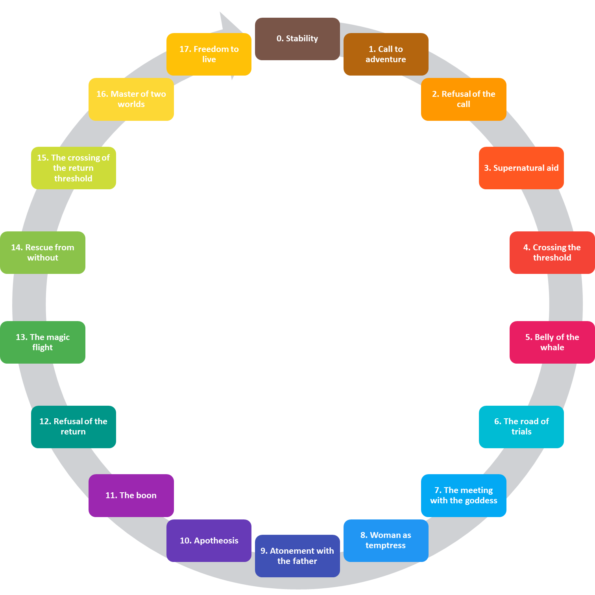

## Neojungian Archetypes

The current state of archetypism is mostly dominated by so-called neojungian authors, using the concept of archetypes to refer to a wide variety of phenomena, including objects and beings (e.g., the snake), narrative patterns (e.g., the hero), symbols and images (e.g., the cross), or practices and rituals (e.g., the sacrifice). Importantly, they view archetypes as an explanatory theory for psychological and cultural phenomena. For instance, it is used to explain the similarities between fairy tales from different parts of the world. This explanatory usage dates back to Jung himself, that drew on patterns derived from myth (e.g. the story of the hero) to explain the psychopathological fantasies of his patients. 


It is important to remember that psychoanalysis, aside from a psychological approach, has also developed as a therapeutic practice. Thus, the shift in neojungian approaches, from a highly abstract and conceptual definition of archetypes, to a more applied and useful usage is not surprising. Archetypes are indeed heavily used in Jungian therapy, with the idea that universal patterns of healthy development are given to all human beings, that can be activated in the process of analysis to guide the therapy to a good end [@roesler2012archetypes].

A concrete use of archetypes in clinical practice is to connect an image, pattern or symbol in the dream of a client to a mythological story or a fairy tile. This allows the unconscious of the client to relate to a broader archetypal pattern which contains additional helpful information. In other words, archetypes are transporters of information which can foster psychological development.

### E. Neumann (1905 - 1960) and the Great Mother

https://en.wikipedia.org/wiki/The_Great_Mother

Despite being one of Jung’s most gifted students, Erich Neumann is a figure whose history is relatively little known. Born in Berlihe attended university in Nuremberg, studying philosophy and psychology, Neumann went on to study medicine but was denied an internship because of the race laws introduced by the Nazi government. Having decided in 1933 to emigrate to Palestine, he travelled first to Zürich where he met Jung, thirty years his senior. Neumann decided to stay in Zürich and enter analysis with Jung, while his wife Julia entered analysis with Jung's wife Emma. After nearly a year of analysis, the coupled qualified as analysts (note that in most psychodynamic streams, undergoing an analysis is the sole qualifying criterion to become an analyst). 


Neumann published *The Origins and History of Consciousness* in 1949, in which he suggests that the consciousness of individuals and of the collective groups developed in parallel. Drawing on a range of myths, Neumann suggests that most cultures produce a succession of archetypes intended to enhance individual self-awareness and maturity. Cultures also developed psychologically, evolving from a collective tribal maternal archetype to a paternal archetype, embodied in a prophet. This archetype eventually became repressive and was replaced by a more modern archetype based on individual responsibility. 

<!-- GREAT MOTHER  -->
https://en.wikipedia.org/wiki/The_Great_Mother
https://www.bu.edu/arion/files/2010/03/Paglia-Great-Mother1.pdf
https://www.tate.org.uk/art/research-publications/henry-moore/tim-martin-erich-neumann-on-henry-moore-public-sculpture-and-the-collective-unconscious-r1151316#fn_1_2


Neumann's work will find a strong echo in art and anthropology, influential for instance for the archaeologist Marija Gimbutas, author of *The Goddesses and Gods of Old Europe* (1974) and *The Civilization of the Goddess* (1991). In her work, she suggests that the Old Europe (pre-indo-european civilization) was composed of woman-centered societies that were peaceful and equalitarian, later supplanted by an indo-european patriarchal and warrior-like culture. However, she will prefer to use the term "Great Goddess" instead of Great Mother to refer to this primordial figure, best describing her absolute rule, her creative, destructive, and regenerative powers.


```{r, echo = FALSE, fig.cap="Neumann's Great Mother."}
knitr::include_graphics("img/neumann_feminine.jpg")
```


### J. Campbell (1904 - 1987) and the Monomyth

> _Dreams are private myths, and myths are public dreams._
>
> `r tufte::quote_footer('--- Joseph Campbell')`

In "The Hero with a Thousand Faces", @campbell1949hero, inspired by Jung, presents his theory of the mythological structure of the journey of the archetypal hero extracted by comparing myths from different regions of the world. Coined the "Hero's Journey", he describes the ultimate narrative archetype as a "monomyth" (a recurring mythological motif). 

Importantly to our topic of archetypes, he identifies common tropes or characters that take part in this meta-narrative. For instance, the young hero, the wise old man or woman, the goddess, the temptress and the shadowy antagonist, that he relates to archetypes. He suggests that such myths and stories have a narrative structure that mirrors or echoes the psychological structure of the mind, which is the reason of their power.

```{r, echo = FALSE, fig.cap="Campbell's (1949) 17 stages of the hero's journey."}

```

### R. Moore (1942 - 2016) and the 4 Archetypes

In "King Warrior Magician Lover", @moore1991king discuss the four primary masculine archetypes:

- King
- Warrior
- Magician
- Lover
  
To each one of these archetypes correspond an immature version: 

- The Divine Child
- The Hero
- The Precocious Child
- The Oedipal Child

  
In the same framework, feminine (although not directly mentioned by the original authors) are:

- Queen 
- Mother
- Wise woman
- Lover

### C. S. Pearson (1944 - Present) and the 12

In "The Hero and the Outlaw", @mark2001hero discuss twelve archetypes:
 
- The Innocent
- The Orphan / Everyman
- The Hero
- The Caregiver
- The Explorer
- The Rebel
- The Lover
- The Creator
- The Jester
- The Sage
- The Magician
- The Ruler


```{r, echo = FALSE, fig.cap="The 12 archetypes and the specific 'universal needs' that they address, grouped by their orientation (ego, order, freedom and social) and type (based on their 'driving source'): the diagonal archetypes (outline in black) correspond to the Self type, the vertical archetypes (outlined in white) to the Ego type, and the horizontal archetypes (outlined in grey) to the Soul type."}
knitr::include_graphics("img/12archetypes.png")
```

This framework has been complexified, grouping these twelve archetypes into sets, for instance by classifying them into three types relative to their "driving source". For instance, the *Ego* type (Innocent, Orphan, Hero and Caregiver) is driven to fulfil ego-defined agendas and *mutatis mutandis* for the *Soul* (Explorer, Rebel, Lover and Creator) and *Self* (Jester, Sage, Magician and Ruler) types. 

Additionally to the type, these archetypes can also be clustered according to their orientation on a two-dimensional plane with four cardinal points, which are *Ego* (leaving a mark on the world), *Order* (providing structure), *Freedom* (yearning for paradise) and *Social* (connecting to others), creating pairs of opposite (Social and Freedom being opposed to Ego Order, respectively).

The type and the orientation are additive groupings. For example, the Caregiver, being of the Ego-type, is driven by the need to fulfil ego agendas, through meeting the needs of others (characterising its social orientation). In a different way, the Hero, also driven by the same need to fulfil ego agendas, does so through courageous action that proves self-worth (characterising its ego orientation).

Finally, each of these twelve archetypes is addressing a specific "universal Human need", namely *safety* (the Innocent), *belonging* (the Orphan), *mastery* (the Hero), *service* (the Caregiver), *freedom* (the Explorer), *liberation* (the Rebel), *intimacy* (the Lover), *innovation* (the Creator), *pleasure* (the Jester), *understanding* (the Sage), *power* (the Magician) and *control* (the Ruler).


However, it is important to note that the framework proposed by @mark2001hero was initially created with companies in mind rather than individuals *per se*, to help new business developing their brand by increasing their identification with specific archetypes. This archetypal branding could facilitate, supposedly, directly communicating with the potential client's unconscious in order to sell more products. This is followed by attempts to attribute dominant archetypes to existing brands. This perspective and usage of archetypes is, in our humble opinion, quite nonsensical in regards with science.


```{r, echo = FALSE, out.width = "49%", fig.show='hold', fig.cap="Examples of association between existing brands and archetypes (retrieved from https://visionone.co.uk/app/uploads/brand-archetype-wheel.png and https://www.retailmarketing.com/wp-content/uploads/2017/09/Pic2.png)."}
knitr::include_graphics(c("img/brand_archetypes1.png", "img/brand_archetypes2.png"))
```


### Other Examples


#### Archetypal Interpretation of the Tarot

Before we dive in into more classical neojungian archetypes, let us make a *detour* by an object which obscure symbolism has *de facto* endowed it with esoteric knowledge which access was attempted using archetype-like concepts.

The first documented tarot packs were recorded between 1440 and 1450, and are likely to have entered Europe from Egypt in the late 14th century. The Tarot consists of 78 cards - 56 in the *Minor Arcana* and 22 in the *Major Arcana* (also known as the trump cards), which consists of the emblematic picture cards of a tarot deck. Although the tarot being a very old game, its interpretation as having a relationship with archetypes was started by Jung himself in [1933](https://marykgreer.com/2008/03/31/carl-jung-and-tarot/). "They are psychological images, symbols with which one plays, as the unconscious seems to play with its contents." The content on these cards, said Jung, "are sort of archetypal ideas, of a differentiated nature."

```{r, echo = FALSE, fig.cap="The 22 cards in the Major Arcana of the 'Tarot de Marseilles'."}
knitr::include_graphics("img/tarot.jpg")
```

The *Major Arcana* consists of 22 cards, numbered in Roman numerals from I to XXI, while The Fool is the only unnumbered card, sometimes placed at the beginning of the deck as 0, or at the end as XXII. They represent, respectively, *The Magician* (I), *The High Priestess* II(), *The Empress* (III), *The Emperor* (IIII), *The Hierophant* (V), *The Lovers* (VI), *The Chariot* (VII), *Strength* (VIII), *The Hermit* (VIIII), *Wheel of Fortune* (X), *Justice* (XI), *The Hanged Man* (XII), *Death* (XIII), *Temperance* (XIIII), *The Devil* (XV), *The Tower* (XVI), *The Star* (XVII), *The Moon* (XVIII), *The Sun* (XVIIII), *Judgement* (XX), *The World* (XXI) and *The Fool* (XXII).

It is understandable that the mysterious origin of the Tarot, its esoteric figures, and critically the symbolic details present in them created a fertile terrain for all kinds of interpretations. Attempts to map these figures to Jungian concepts have been numerous. For instance, the Fool, interpreted as carefree ignorance, has been connected with the unrealised Self. He carries a closed bag, said to contain the tools that could allow him to achieve wholeness. On the other side, the World card (XXI), representing completion and success, has been related to the Self realised, as it shows an individual floating amongst the clouds. His nudity can be interpreted as transparency and revelation, where what was hidden before has now become known. The four animals present in the corners corresponds to the four elements in Christian symbolism, and are interpreted as evidence that the individual has harnessed the four elements present within Nature (being the fifth element).


#### Coaching


The coach Scott Jeffrey, after disguising random information as facts (e.g., *"archetypes influence 99% of human behavior"*), ends up with a list of [over 325](https://scottjeffrey.com/archetypes-list/) archetypes (!), suggesting that their number is even larger (*"the reality is that there are thousands of archetypes. Each one possesses different behavioral patterns and subtleties"*). Besides the uselessness of an infinitely fined-grained concept, these classifications (that the author defines himself as *"set patterns of behavior"*) are clearly different from archetypes as conceptualised in this book.


```{r, echo = FALSE, fig.cap="The 12 female archetypes described by Lucie René, supposedly 'handed down from the Matrilineal Era' but later 'fractured, polarized, and corrupted during the Patriarchy' (retrieved from https://luciarene.com/pdfs/Archetype-Diagram.pdf)."}
knitr::include_graphics("img/female_archetypes.jpg")
```
